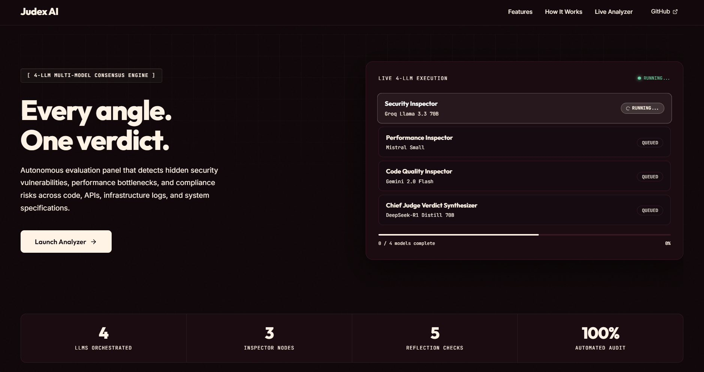

# Judex AI — Multi-Agent Consensus Security & Architecture Audit Platform

**A single AI model has one blind spot. Judex AI has none.**

Judex AI runs every piece of code, API spec, security log, or technical document
you give it through a panel of four independent AI models — each with a
different job — and synthesizes their findings into one weighted, cited,
and reasoned verdict. It's not a chatbot wrapper around one model; it's a
full audit pipeline: retrieval, cross-examination, consensus, remediation,
and memory.

Built as an exploration of the "Panel of Judges" pattern — multiple models
cross-checking each other, the way a legal team cross-examines a contract
before signing it.

---

## What it does

- **Panel of Judges** — Groq Llama 3.3 70B (Security), Mistral Small (Performance),
  and Gemini 2.0 Flash (Code Quality) each independently inspect your content.
  A DeepSeek-R1 Chief Judge then synthesizes all three reports into one final,
  weighted verdict — flagging exactly where the models agreed and disagreed.
- **Citation-backed findings** — every flagged issue is grounded in a real,
  named industry standard (OWASP, NIST, PEP 8, RFC 7807, and more) via a
  HyDE + ChromaDB retrieval layer, with a Self-RAG relevance check that
  retries the search if the first pass wasn't relevant enough. Citations are
  clickable straight to the source.
- **Judex Playbook** — define your org's own security rules once (Fintech,
  Healthcare, Startup, or Enterprise baselines, or fully custom rules), and
  every future audit checks against them automatically. Rules are
  content-type aware — different checks apply to pasted code vs. an API
  spec vs. a security log — and the right profile is auto-suggested from
  what you paste, with manual selection always taking priority.
- **Show the Why** — a 5-point reflection pass validates the verdict before
  it's shown to you, so you get the reasoning trail behind a decision, not
  just a pass/fail badge.
- **Autonomous patch engine** — generate a signature-preserving security fix
  with a GitHub-style red/green diff in one click. "Autopilot" mode remediates
  every flagged file in an uploaded repository at once and returns a signed
  audit certificate.
- **Institutional precedent memory** — findings are matched against how
  similar issues were resolved in prior audits, so recommendations come
  with real precedent instead of generic advice.
- **Blast-radius dependency graph** — an interactive graph shows exactly
  what else in your codebase is affected if a flagged function changes.
- **Whole-repository audits** — upload a project `.zip` and get a
  repository-wide health score across every file and every language it
  detects, not just one snippet at a time.

## How it works

A 5-step pipeline runs on every single analysis, in order, every time:

1. **Retrieve** — HyDE + ChromaDB vector retrieval pulls the most relevant
   standards for the detected content type.
2. **Self-Eval** — a Self-RAG relevance check scores what was retrieved; if
   it's not relevant enough, it retries with a refined query.
3. **Inspect** — the three independent Inspector models analyze the content
   in parallel, each with the retrieved standards injected into its prompt.
4. **Chief Judge** — the fourth model synthesizes all three inspector
   reports into one verdict, a disagreement heatmap, and a temporal risk
   score (how the finding would be judged against today's standards).
5. **Reflect** — a final validation pass checks the verdict for internal
   consistency before it's returned. If the live Chief Judge call fails for
   any reason, the fallback verdict is derived directly from the actual
   live inspector reports — never a generic canned summary that could
   contradict what the inspectors found.

Supported input types are auto-detected: Python, JavaScript/TypeScript,
Java, Go, Rust, C/C++, C#, PHP, Ruby, Swift, SQL, Shell, Dockerfiles,
Kubernetes manifests, HTML/CSS, JSON configs, OpenAPI/Swagger specs,
security logs, and technical specs.

## Screenshot



## Tech stack

**Backend:** FastAPI, ChromaDB (vector store, lightweight ONNX embeddings),
Groq / Mistral / Gemini APIs.

**Frontend:** React 19, Vite, Framer Motion, GSAP + Lenis (scroll
animation), `@xyflow/react` (dependency graph), Recharts.

## Getting started

### Backend

```bash
pip install -r backend/requirements.txt
cp .env.example .env   # fill in your API keys
uvicorn backend.main:app --reload --port 7771
```

### Frontend

```bash
cd frontend
npm install
npm run dev
```

The dev server proxies `/api` to `http://localhost:7771` (see
`frontend/vite.config.js`). Open `http://localhost:5173`.

### Environment variables

| Variable | Required for |
|---|---|
| `GROQ_API_KEY` | Security Inspector, Chief Judge, patch generation |
| `MISTRAL_API_KEY` | Performance Inspector |
| `GEMINI_API_KEY` | Code Quality Inspector |

All three have free tiers. If a key is missing or a live call fails, Judex
falls back to a deterministic, content-aware response rather than crashing
— though live results are always used when available.

## API overview

| Endpoint | Purpose |
|---|---|
| `POST /api/analyze` | Analyze pasted content (code, spec, API doc, log) |
| `POST /api/analyze-zip` | Audit an entire uploaded project `.zip` |
| `POST /api/upload-document` | Parse an uploaded document into analyzable text |
| `GET /api/playbook-profiles` | List built-in Judex Playbook org profiles |
| `POST /api/generate-patch` | Generate a single-file security patch + diff |
| `POST /api/patch-zip` | Apply patches to specific files in a project `.zip` |
| `POST /api/autopilot-zip` | Remediate every flagged file in a project at once |
| `GET /api/health` | Health check |

## Project structure

```
backend/
  main.py              FastAPI app + routes
  analyzer.py           Orchestrator: content detection, LLM calls, fallback logic
  langgraph_pipeline.py Sequential 5-node analysis pipeline
  playbook.py            Judex Playbook: org rule profiles + compliance checks
  patch_engine.py         Patch generation + Autopilot remediation
  rag_engine.py            ChromaDB + HyDE retrieval
  rag_knowledge_base.py     Seeded standards knowledge base
  dependency.py / temporal.py / reflection.py   Supporting analysis modules
  zip_parser.py / repo_analyzer.py               Multi-file repository audit

frontend/src/
  App.jsx                 Top-level state + orchestration
  components/              UI components
  hooks/                    Smooth scroll + section-snap hooks
  utils/                     Citation link resolution, playbook auto-suggest
```

---

Built as a personal project exploring multi-agent LLM consensus patterns
applied to security and code review.
